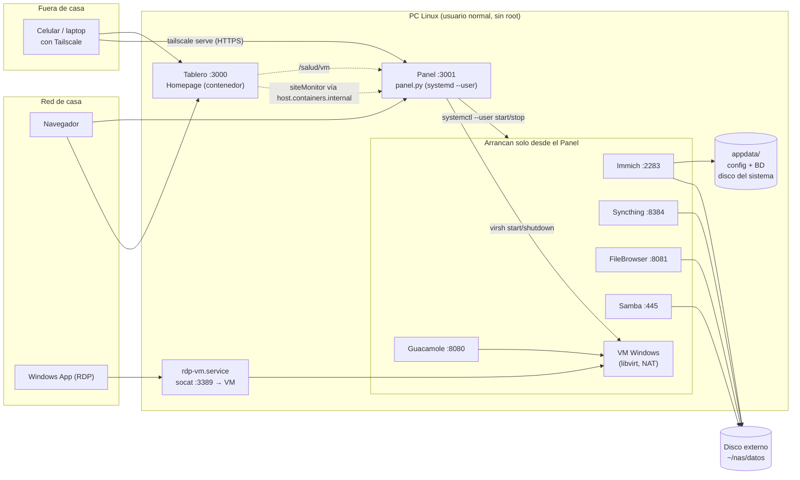

# NAS a demanda

Un NAS casero sobre una PC Linux normal, armado con **podman rootless + quadlets**:
fotos (Immich), respaldo de celulares (Syncthing), explorador de archivos (FileBrowser Quantum),
carpetas de red (Samba) y, opcionalmente, una VM de Windows. Todo con dos páginas para usarlo sin terminal:

- **Tablero** (`:3000`, [Homepage](https://gethomepage.dev)) — la página de entrada: un mosaico por servicio
  con su punto verde/rojo.
- **Panel de encendido** (`:3001`, Python sin dependencias) — botones *Encender / Apagar* por servicio.

**La idea central: nada arranca solo salvo el Tablero y el Panel.** Cada servicio se enciende
**a demanda**, y el Panel se niega a encender lo que usa el disco de datos si ese disco no está conectado.
Así una PC de uso diario puede ser NAS sin gastar RAM en lo que no usas, y nada escribe por error en el
disco del sistema. Los porqués están en [DECISIONES.md](DECISIONES.md).

## Cómo se conecta



## Qué hay en el repo

```
~/nas/                         ← el repo se clona AQUÍ (los quadlets usan %h/nas)
├── stack/        quadlets: un .container por servicio + la red interna "nas"
├── panel/        el Panel de encendido (panel.py + index.html, solo librería estándar)
├── systemd/      servicios de usuario: el Panel y el organizador de fotos (+ su timer)
├── sistema/      servicio de SISTEMA opcional: publica el RDP de la VM en la red de casa
├── plantillas/   config inicial del Tablero, FileBrowser, Samba y Guacamole (con ${VARIABLES})
├── bin/          claves.sh (muestra tus usuarios/claves) · organizar-por-fecha.sh (vista de fotos)
├── scripts/      verificar-sin-datos-personales.sh (pre-commit: tus datos no llegan a git)
├── tests/        pruebas del Panel
├── docs/         guías: editar el Tablero, acceso desde fuera, VM de Windows
├── .env.example  tus direcciones y claves (cópialo a .env — nunca se sube)
└── instalar.sh   instala/actualiza, idempotente

Lo que crea la instalación y NO va a git:
├── .env · tablero.env       tus valores y secretos
├── appdata/                 configuración y BASES DE DATOS (siempre en el disco del sistema)
└── datos -> /ruta/al/disco  enlace a la carpeta del disco externo
```

## Requisitos

- Linux con systemd y **podman ≥ 4.4** (quadlets). Probado en Fedora.
- `python3` (el Panel no usa paquetes externos).
- Un disco de datos montado (externo o interno). **La base de datos de Immich NO puede vivir en NTFS/exFAT/FAT**
  — por eso `appdata/` va en el disco del sistema y solo los archivos van al disco de datos.
- Opcional: libvirt + una VM de Windows; `socat` para el relay RDP; [Tailscale](https://tailscale.com) para
  entrar desde fuera; Cockpit; Portainer si además usas Docker.

## Instalación

```bash
git clone https://github.com/AliazCIA/nas-a-demanda.git ~/nas
cd ~/nas
./instalar.sh                 # 1.ª vez: crea .env, tablero.env y samba.env y se detiene
$EDITOR .env tablero.env appdata/samba/samba.env
ln -sfn /ruta/al/disco/NAS ~/nas/datos   # carpeta del disco de datos (con fotos/, archivos/, dispositivos/)
./instalar.sh                 # enlaza los quadlets, deja arriba el Tablero y el Panel
```

Después entra a `http://<NAS_IP>:3000` y enciende lo que uses desde el Panel. Para ver tus claves:
`~/nas/bin/claves.sh`.

- **VM de Windows (opcional):** [docs/vm-windows.md](docs/vm-windows.md).
- **Acceso desde fuera de casa (Tailscale, sin abrir puertos):** [docs/acceso-remoto.md](docs/acceso-remoto.md).
- **Editar el Tablero:** [docs/tablero.md](docs/tablero.md).

## Uso diario

| servicio | para qué | dirección | arranca con la PC |
|---|---|---|---|
| Tablero | página de entrada | `http://<NAS_IP>:3000` | **sí** |
| Panel | encender / apagar todo lo de abajo | `http://<NAS_IP>:3001` | **sí** |
| Immich | biblioteca de fotos y video | `:2283` | no |
| Syncthing | respaldo continuo de celulares y laptops | `:8384` | no |
| FileBrowser Quantum | explorador de archivos web | `:8081` | no |
| Samba | carpetas de red (`\\<NAS_IP>`) | `:445` | no |
| VM de Windows | escritorio por RDP | `<NAS_IP>:3389` | no |
| Guacamole | la VM dentro del navegador | `:8080/guacamole` | no |

**Mientras un servicio esté apagado, no hace su trabajo**: con Immich apagado el celular no sube fotos.

```bash
systemctl --user status nas-panel nas-tablero immich-server   # estado
systemctl --user start  nas-samba                              # lo mismo que el botón del Panel
podman ps
python3 -m unittest discover -s tests -v                       # pruebas del Panel
```

### Mudarlo a otra máquina

Los **archivos** viven en el disco de datos; el **sistema** vive en `~/nas` (unos MB). Copia `~/nas`
(con su `.env` y `appdata/`), conecta el disco, repunta `~/nas/datos` y corre `./instalar.sh`.

### Fotos organizadas por fecha (opcional)

`bin/organizar-por-fecha.sh` arma cada hora (timer `organizar-fotos.timer`) una vista
`datos/fotos-por-fecha/<persona>/<AÑO>/<AÑO-MM-DD>/{fotos,videos}/` con **enlaces duros** sacados de la
base de Immich: encuentras tus fotos sin Immich y no ocupa espacio extra. **No es respaldo** (son los
mismos bytes).

## Seguridad

- El Panel pide usuario y clave (Basic auth); `/salud` y `/salud/vm` responden sin login y no revelan nada.
  Las acciones exigen el encabezado `X-Panel` (protege contra CSRF).
- En la LAN el Panel va por HTTP en claro; desde fuera, solo por `tailscale serve` (HTTPS). **Nunca abras
  puertos en el módem.**
- Un solo disco **no es respaldo**: falta una segunda copia.

## Contribuir

Lee [AGENTS.md](AGENTS.md) (las reglas del repo). El pre-commit `scripts/verificar-sin-datos-personales.sh`
impide que tus IPs, nombres o claves lleguen a git: instálalo con
`scripts/verificar-sin-datos-personales.sh --instalar`.

Licencia: [MIT](LICENSE).
